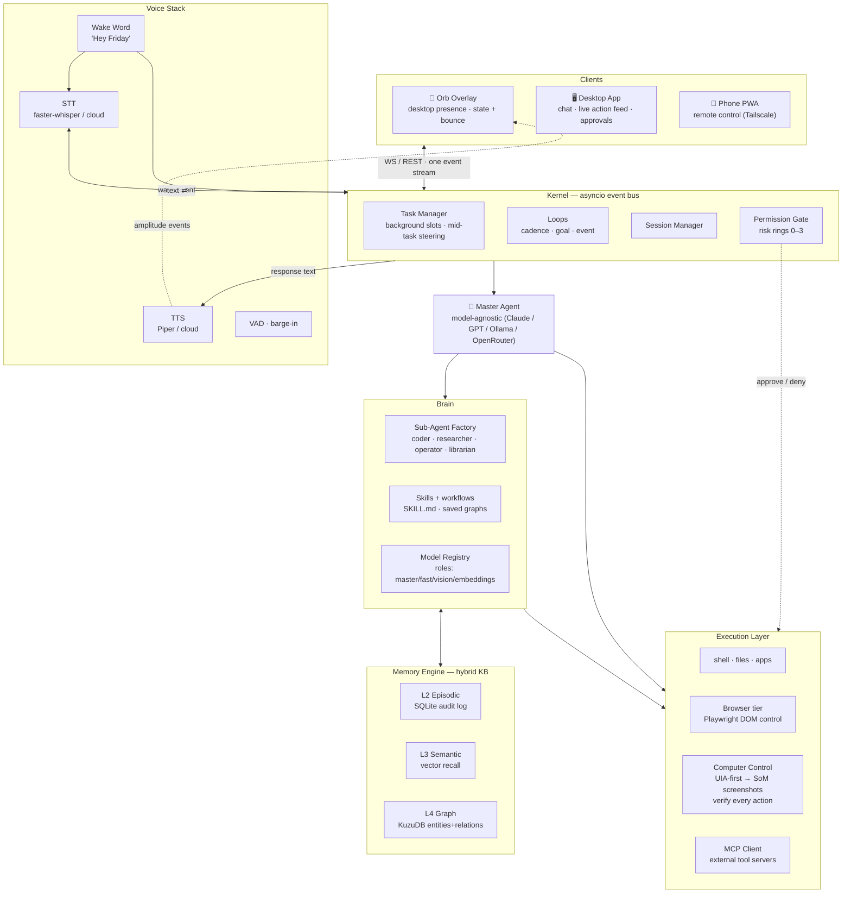

# AgentOS — "Friday" Architecture Plan

A resident desktop AI agent for Windows: wake-word voice loop, model-agnostic multi-agent brain,
layered knowledge base, MCP integration, vision-driven computer control, and a self-hosted
phone/dashboard interface.

> **Agents building or changing AgentOS**: work from [AGENTARCH.md](AGENTARCH.md) for the
> build sequence, done-conditions, and runtime contracts. Work from [PRINCIPLES.md](PRINCIPLES.md)
> when adding a **loop**, a **node**, a skill, a schedule, or anything that runs while the
> user is away. This doc is rationale only.

---

## 1. System Overview



**One process, many engines.** Everything plugs into an asyncio event bus so voice,
clients, tools, and sub-agents share one session/state. Recurring work is a **loop**
(cadence / goal / event), not another chat. Multi-item work is a graph of **nodes**.
The rules that survive every phase live in [PRINCIPLES.md](PRINCIPLES.md).

---

## 2. Brain — Master Agent + Sub-Agents

### Model Registry (`models.yaml`)
Every provider is an adapter behind one interface. You pick the master later; nothing hardcodes it.

```yaml
providers:
  anthropic: { api_key_env: ANTHROPIC_API_KEY }
  openai:    { api_key_env: OPENAI_API_KEY }
  ollama:    { base_url: http://localhost:11434 }
  openrouter: { api_key_env: OPENROUTER_API_KEY }   # unlocks ~100 models

roles:                    # swap anytime, zero code changes
  master:      claude-sonnet-4-5        # orchestrator
  coder:       claude-sonnet-4-5        # coding sub-agent
  fast:        llama3.1:8b (ollama)     # cheap classification/routing
  vision:      gpt-4o                   # screenshot grounding
  embeddings:  text-embedding-3-small
```

### Orchestration pattern
- **Master agent** holds the conversation, decides *what to do*, never does heavy work itself.
- **Sub-agent factory**: `spawn(role, task, tools=[...], model=...)` → runs in its own
  asyncio task with its own context window, returns a structured result.
  - `coder` — shells out to installed CLIs (opencode, claude code, aider) or writes code itself
  - `researcher` — web search/fetch loops, writes findings into the KB
  - `operator` — GUI/browser control (see §6)
  - `librarian` — KB read/write, consolidation (see §3)
- Handoff protocol: each **node** returns a schema (`{status, result, artifacts[], kb_writes[]}`
  as the baseline). Validation retries at the tool layer so the next **node** does not parse vibes.
- The maker never marks its own work **verified**. A checker is a different prompt (often `fast`)
  with no view of the maker's chain of thought; a machine signal beats a second LLM.
- A cheap "router" pass classifies trivial requests ("what time is it") to the fast local
  model, saving cost/latency. Control flow after that classification lives in code
  (`if` / `switch` on the schema), so Friday cannot skip an audit it was not given as a branch.

### Loops — Friday prompts Friday
A **task** is one background shot the user can **steer**. A **loop** is a system: an
automation fires, Friday reads **resume** + **charter**, does the work, a **verified**
signal accepts or rejects, state is written, a cap or a **card** stops it.

Three automations:

| Kind | Fires | Stops |
|---|---|---|
| Cadence | schedule (morning briefing, weekly bump) | the run ends; next tick is a new run |
| Goal | now, or on an event | a condition scored by `fast` or a machine check is true |
| Event | kernel bus, filesystem watch, MCP webhook | one shot, or it arms a goal |

Overnight output is a ring 0–1 draft. Ring 2–3 still need a **card**. First **loop** is
one job, one skill, one **resume**, one **verified** signal, then a schedule. The
4-condition test and the rest of the rules: [PRINCIPLES.md](PRINCIPLES.md).

### Graphs — shape of a job
A sequential tool loop is the right shape for a single chat. Multi-item or multi-source
work is a graph: **nodes** with schema contracts, **edges** that carry data (flatten /
dedupe / filter in code), diamond (split → parallel work → merge) as the default fan-out.

Wait for every **node** only when the next stage needs the whole set. Fan-in tolerates
a missing input. Writers that run together get isolation (worktree / separate root).
Models are tiered per **node**, not inherited from `master` for the whole fan-out.

Saved graphs live in `workflows/` next to skills, launched by name, by chat, or by a
**loop**. The master may write an orchestration script for a job that cannot be planned
in advance; one hand-drawn diamond ships before that.

---

## 3. Knowledge Base — The Plan (hybrid, 4 layers)

**Answer: not graph-only, not RAG-only. Each layer earns its keep:**

| Layer | What | Tech (embedded, no servers) |
|---|---|---|
| L1 Working | Current session state, scratchpad | in-memory + SQLite snapshot |
| L2 Episodic | Every interaction log (who/when/what/tools/results) | SQLite (`events` table) |
| L3 Semantic | Vector index of docs, notes, research, transcripts | LanceDB or Chroma (local) |
| L4 Graph | Entities + relationships, facts, preferences | KuzuDB (embedded graph DB) |

A **loop** also reads two files that are not these layers:

- **charter** — standing user goals and hard constraints, reread every run so summarization
  cannot drop "never do X." Distinct from the system prompt in `models.yaml`.
- **resume** — `{done, next, rejected[], spend, last_verified}`. Tomorrow continues.
  L1 is a scratchpad. L2 is an audit log. Neither is **resume**.

### Why both graph AND vectors?
- Vectors answer *"anything like X?"* (fuzzy recall).
- Graph answers *"how is A connected to B?"* (multi-hop facts: which repo belongs to which
  project, what did I promise whom, dependencies between people/projects/preferences).
- Real agent memory needs both — pure RAG forgets structure, pure graphs are brittle to phrasing.

### Schema sketch

```cypher
-- KuzuDB nodes
(:Person {id, name, relation})
(:Project {id, name, path, status})
(:Preference {key, value, confidence})      // "user prefers dark mode", "no sudo without asking"
(:Fact {id, statement, source_event, confidence, valid_from, valid_to})
(:SkillRef {name, version, confidence, success_rate, last_run})
-- edges
(Person)-[:OWNS]->(Project)
(Fact)-[:ABOUT]->(Person|Project|...)
(Fact)-[:SUPERSEDES]->(Fact)                // temporal: new facts invalidate old ones
```

### Retrieval pipeline (every master-agent turn)
```
query ──┬─► vector search (L3, top-k=8)
        ├─► graph walk (L4: seed entities → 2-hop neighborhood)
        └─► BM25 keyword (SQLite FTS5 over L2/L1)
             ↓
        rerank (cheap model) → dedupe → inject as context block
```

### Write path — staged rollout (consolidation is earned, not assumed)

Auto-extraction, entity resolution, and drift are the classic failure modes here, so the
write path ships in stages gated by evals (see §9):

- **Stage 0 (day one):** every episode logged to L2 verbatim + user-confirmed fact capture
  only — Friday may *propose* a fact ("should I remember your standup is at 9?"), stored
  when you confirm. No automatic graph/vector writes.
- **Stage 1:** librarian drafts facts/entities/relations as **reviewable proposals** in the
  dashboard; bulk-approve workflow. Graph stays minimal (`Person/Project/Fact/Preference`).
  Superseded facts get `valid_to`, never deleted — auditable memory.
- **Stage 2 (unlocked only when evals show acceptable recall accuracy + low contradiction
  rate):** fully automatic consolidation after each session, preference confidence updates,
  passive skill mining enabled.

### Skills — self-created procedural memory

Skills are the *procedural* half of the KB, and **Friday writes its own**:

**Format**: `skills/<name>/SKILL.md` (name, description/trigger phrases, step-by-step
procedure, parameter slots, optional scripts) — same shape as Claude Code skills, so
community skills work too.

**Three creation triggers (in trust order):**

1. **Active suggestion (primary path)** — right after Friday completes a novel 3+ step
   task, it asks: *"This took 6 steps — want me to save it as a skill? I'd call it
   `weekly-report`."* One "yes" promotes it.
2. **Explicit teaching** — "Friday, watch me do this / remember this as `deploy-app`":
   user-driven recording → distillation. Highest signal, zero noise.
3. **Passive mining (gated)** — trajectory clustering for recurring flows runs only after
   Stage-2 memory unlocks and the eval harness shows candidate precision is acceptable;
   everything still passes through the approval queue.

**Distillation pipeline (librarian sub-agent):**
```
successful trajectory (episodic L2)
  → generalize: strip session specifics into {{parameters}}, extract preconditions,
    write procedure + failure notes from retries
  → draft SKILL.md
  → validate: dry-run against recorded inputs where possible; lint tool names/paths
  → approval queue in dashboard (diff view) → user approves/rejects/edits
  → promoted to library, embedded into L3 for trigger-matching
```

**Lifecycle & feedback loop:**
- Every skill run is logged; success rate tracked per skill (`confidence` field) —
  aggressively: a skill that fails twice in a row is auto-suspended pending review.
- Failing skills trigger librarian fix proposals (or deprecation) into the approval queue
  as first-class items — skills evolve instead of rotting.
- Versioned (`v1, v2...`) so rollbacks are one click; user edits always win over agent edits.

**Autonomy dial** (`permissions.yaml`, default **`suggest_only`**):
`suggest_only | auto_create_low_risk | fully_autonomous`.

Community skills are **untrusted** until a human reads the source. Install is a **card**.
A **loop** that auto-installs skills inherits every injection in their descriptions.

### MCP = borrowed capabilities
- `mcp_manager`: spawns/connects any MCP server (stdio/SSE), merges its tools into the
  master's tool list dynamically.
- Config: `mcp_servers.json` — filesystem, GitHub, browser, Notion, whatever you add.
- MCP tools and native tools are indistinguishable to the model.
- Connectors exist so a **loop** can act in the real environment (open the PR, update the
  ticket, ping the channel, watch the disk), not only describe what it would do. Rank
  them by whether the **loop** can finish the job: GitHub, filesystem/calendar watches,
  Linear/Jira, Slack, error tracker.

---

## 4. Tool Layer (native)

| Tool | Implementation |
|---|---|
| `shell` | PowerShell subprocess, streaming output, timeout + approval gate |
| `files` | sandboxed read/write/move/search over chosen roots |
| `apps` | launch/close/focus Windows apps (`Start-Process`, pywinauto) |
| `browser` | Playwright (Chromium profile = your cookies) — DOM-level control |
| `vision_query` | ask questions about screen/camera/image (via vision model) |
| `kb_read/write`, `skill_run`, `spawn_subagent` | internal |

---

## 5. Voice Stack — fully configurable, all three modes

`voice.yaml` selects per-component implementations; everything behind one `VoiceIO` interface:

```yaml
mode: local            # local | cloud | realtime
wake_word:
  engine: openwakeword # custom "Hey Friday" ONNX | porcupine | none
stt:
  local: faster-whisper (small/int8)     # GPU if available
  cloud: groq whisper-large-v3-turbo     # file POST; barge-in stays local
tts:
  local: kokoro-82M (speech) / piper (blips)
realtime:              # mode=realtime bypasses stt/tts entirely; last
  provider: openai-realtime
vad: silero            # turn-taking, barge-in support
```

Loop: wake word fires → chime → stream mic → VAD segments utterance → STT → kernel →
master responds → TTS speaks (barge-in cancels playback). In `realtime` mode the whole loop
is one persistent socket; wake word still gates when the mic is hot.

---

## 6. Computer Control — accessibility-first, verified, honest about being stuck

Two tiers, browser first because DOM > pixels for reliability. **Rule of thumb: pixels are
the last resort, not the default** — pure vision loops are expensive, slow, and brittle
(Electron apps, custom controls, multi-monitor DPI scaling, and games break them often).

1. **Browser tier**: Playwright reads real DOM/a11y tree → model picks elements by ref →
   clicks/typing are exact. Fast, reliable, works headless or headed.
2. **Native tier (a11y-first)**: Windows UIA via pywinauto enumerates real elements of
   known apps → actions target element handles, not pixel guesses.
3. **Vision tier (fallback only)**:
   ```
   screenshot (mss) ──► annotate Set-of-Marks: OCR + icon heuristics over the a11y
                        elements we couldn't resolve → overlay numbered labels
        ► vision model returns {label|coords, action} 
        ► execute via pyautogui/pydirectinput 
   ```
4. **Verify after EVERY action** (all tiers): re-screenshot / re-read state and diff against
   expectation. No action is considered done until verified; unverified ≠ success.
5. **Stuck protocol**: after N failed verifications or low-confidence grounds, stop — don't
   retry blindly. Escalate: ask you a targeted question ("the Save dialog didn't appear —
   should I reopen Notepad?") with a screenshot attached, or hand back to master to replan.

### Rollout: constrained before free
- **v1 operator allowlist mode**: known apps + browser only (`chrome, notepad, vscode,
  explorer, spotify...`), single monitor, fixed DPI. Full-desktop freedom unlocks later,
  gated by eval numbers (§9), never day one.

---

## 7. Surfaces — Desktop App, Orb & Phone Control

**Backend (shared)**: FastAPI + WebSockets inside the kernel process; one event stream
(`agent.state`, `tool.call`, `approval.request`, `tts.amplitude`, ...) feeds every client.
Auth token + Tailscale for secure access from anywhere (no port forwarding).

### 7a. Desktop app (Tauri 2 — Rust toolchain already installed)
Native Windows app, ~10MB footprint, two window types:

**Main window — mission control:**
- Chat interface w/ full history (streamed tokens)
- **Live action feed**: every tool call, screenshot thumbnail, browser step, sub-agent
  spawn/cancel as it happens (subscribes to the same event stream)
- Approve/deny inbox for guarded actions · task/sub-agent monitor · skills & MCP managers
- KB browser (graph viz + semantic search)

**Orb overlay — Friday's "presence" on your desktop:**
Frameless, transparent, always-on-top ~140px circular companion window (click-through when
idle except the orb itself; draggable; click = open main window, right-click menu = mute mic,
sleep, quit).

| State | Trigger | Animation |
|---|---|---|
| hidden | system asleep | nothing |
| idle | running | slow breathing pulse |
| waking | `"Hey Friday"` detected | **pops in** — scales from 0 → overshoot → settle, ripple ring |
| listening | mic hot / VAD active | expands subtly with input amplitude |
| thinking | master agent working | inner swirl/particles speed up |
| speaking | TTS streaming | **bounces + zooms in-out synced to audio RMS envelope** |

Implementation: WebGL/Canvas shader orb inside the overlay; kernel publishes state events +
TTS amplitude envelopes over local IPC (~30fps); spring physics (overshoot/settle) for the
pop-in and bounce so it feels physical, CSS transitions for the cheap states.

### 7b. Phone (PWA)
Same React UI packaged as installable PWA at `https://<tailscale-name>`:
chat + history, voice notes, live screen view, approvals, notifications.
The orb appears here too as an animated header avatar driven by the same events.

---

## 8. Interaction & Autonomy — questions, permissions, background work

### Clarification-first (never guess on what matters)
Before acting, a cheap fast-model pass scores the request for ambiguity:
- **Clear** → act immediately.
- **Trivial stakes** → state an assumption and proceed (*"Saving to Downloads unless you say otherwise"*).
- **Genuinely unclear** → ask up to 2–3 **batched, targeted questions**, never interrogation loops.
  Questions render wherever you are: spoken aloud if voice-initiated, or as a chat card with
  tap-chips (`Option A · Option B · You decide`) on desktop/phone.
- Ambiguity patterns it learns: your recurring answers become preferences in the graph
  (§3), so the same question is rarely asked twice.

### Interactive permissions (rich, not just yes/no)
Approval requests are cards showing **what / why / exact command preview / risk ring**, and:
- Arrive on every surface at once — desktop toast, orb pulses amber, phone push.
- Support scoped grants: `once` · `always for this app` · `always for this command pattern`
  (stored in permissions.yaml, revocable in the UI).
- Pending approvals **auto-expire → default deny** (configurable), so nothing dangerous
  executes while you're away.
- While blocked, that task pauses but everything else keeps running (see below).

### Background operation & multitasking (you keep working, Friday keeps working)
The kernel runs a **task manager with N concurrent slots**; the conversation is never blocked.
Independent work fans out as **nodes**. "Research these 5 laptops" is five researcher
**nodes**, a code reduce, one synthesizer, not one researcher chewing them in a line.
```
you: "research these 5 laptops and build me a comparison doc"
     └─ task #1 diamond: 5 researcher nodes → reduce → synthesizer
you: "meanwhile open Spotify"          ← instant, interleaved
you: "also use Chrome not Edge for #1" ← mid-task steering, routes into task #1
...20 min later...
Friday: 🔔 "Laptop comparison ready — want me to email it?"   (voice if you're at the
         desk, phone push if not; presence detection optional)
```
- Every task = `{id, status: queued|running|blocked|waiting_approval|done|failed, progress}`
  streamed live to the action feed + orb.
- **Mid-task replies**: messages prefixed by a task reference (or auto-routed when only one
  task is active) go straight to that task's running sub-agent — correct it, feed it info,
  change scope without restarting.
- **Needs-you pauses**: a task stuck on approval or a clarifying question parks itself,
  notifies you, resumes the moment you answer — even hours later, full context intact.
- Results land where you asked: file, clipboard, chat summary, or spoken.

---

## 9. Reliability — evals, latency, presence

### Eval harness (the system is something we measure)
A small suite of repeatable scenarios run against the real stack:
- desktop tasks: open app X → do Y → verify Z (state-checked programmatically)
- multi-step research + file write · permission-gated actions · memory recall after N turns
- tracked per run: **success %, end-to-end latency, token cost, # human interventions,
  cost per accepted outcome**
Run before/after every meaningful change; the numbers gate Stage-2 memory, passive skill
mining, full-desktop operator freedom, and scheduling a **loop**.

Loop-shaped scenarios sit next to the desktop ones: a known-bad artifact the **verified**
signal rejects; **resume** after process restart; false-done (maker claims complete,
checker or test says no); fan-out with one dead worker still merging; the token cap
killing a runaway. If fewer than half of a **loop**'s outputs survive **verified**,
the **loop** is creating review work.

### Latency & perceived speed
The full loop (wake → STT → retrieval → master → sub-agents → vision → TTS) can feel
sluggish — so:
- **Fast paths**: trivial requests skip retrieval/sub-agents entirely and hit the local
  fast model.
- **Speculative prep**: wake-word chime pre-warms STT; likely tools warm their processes;
  TTS streams first sentence while the rest generates.
- **Stream everything**: partial tokens to chat, agent-state changes to the orb in real
  time — perceived responsiveness beats architectural perfection.
- The orb's fancy animations ship **after** the agent is useful; polish follows function.

---

## 10. Safety & Security Model

| Ring | Allowed | Gate |
|---|---|---|
| 0 read-only | screenshots, file reads, web fetch | none |
| 1 normal | app launch, file writes in approved roots, browser actions | silent, logged |
| 2 elevated | shell commands outside allowlist, installs | approval card (§8) |
| 3 critical | deletes>threshold, purchases, emails/messages, credentials | explicit confirm, always |

**Security hardening (this stack is a high-privilege target):**
- **Prompt injection is expected, not hypothetical** — screen content, OCR'd text, and web
  pages are untrusted input. Text extracted from screenshots/web is wrapped and labeled
  `untrusted`; it can inform but never *trigger* tools or change permissions.
- **Permission model is the single source of truth** — no tool executes outside it, no
  exceptions for "the model was sure".
- Secrets live in env/.env only; never in prompts, logs, context windows, or the KB. Tool
  processes get scoped env; the master's context is scrubbed of secret-shaped strings.
- Sandboxing where possible: tool subprocesses run with restricted tokens/working roots;
  MCP servers are pinned + allowlisted versions.
- Everything logged to L2 → full audit trail: what ran, what it saw, what it did, who
  approved.

**Unattended Friday.** A **loop** at 3am is an attack surface at 3am. Overnight work
stays ring 0–1 and produces drafts. Ring 2–3 wait on a **card**. Long runs use quiet
logging so secrets never scatter into L2. Loop permissions are re-audited on a 30-day
calendar. Skill text is **untrusted**; install from the internet is a **card** after a
human reads the source. The user still reads the overnight digest. The live feed does
not replace that. Full rules: [PRINCIPLES.md](PRINCIPLES.md).

---

## 11. Repo Layout

```
AgentOS/
├─ ARCHITECTURE.md          ← this file
├─ AGENTARCH.md             ← phases, contracts, leading words
├─ PRINCIPLES.md            ← how we build; loops, graphs, unattended
├─ config/
│  ├─ models.yaml  voice.yaml  permissions.yaml  mcp_servers.json
├─ kernel/                  # event bus, sessions, task manager (concurrency), permission gate
├─ brain/                   # model registry, master agent, sub-agent factory
├─ memory/                  # sqlite events, lance/chroma vectors, kuzu graph, librarian
├─ voice/                   # wakeword/, stt/, tts/, realtime/, vad/
├─ tools/                   # shell, files, apps, browser(playwright), computer_use(SoM)
├─ mcp/                     # client manager
├─ server/                  # FastAPI + WS gateway (single event stream for all clients)
├─ ui/                      # shared React components (chat, feed, approvals) used by both
├─ desktop/                 # Tauri 2 app: main window + transparent orb overlay
├─ dashboard/               # phone PWA build (reuses ui/)
├─ skills/                  # SKILL.md library (user-editable, agent-extensible)
├─ workflows/               # saved graphs, launched by name / chat / loop
└─ main.py                  # entrypoint: boots kernel + selected voice mode
```

## 12. Build Order — collapsed, trustworthy-core first

1. **Phase 1 — The chat loop that deserves trust** ✱everything downstream depends on this✱
   kernel event bus + task manager · model registry · master agent w/ clarification &
   permission cards · basic tools (shell, files, Playwright browser) · simple sub-agent
   spawning · SQLite episodic logging · CLI chat loop.
2. **Phase 1b — First real loop** (after Phase 1; may run beside Phase 2; required before
   Phase 6): one recurring machine-checkable job. Manual run → one skill → **resume** →
   **verified** signal → schedule or event. Caps declared. Overnight output is a draft.
   No swarm, no self-drawn graph. Rules: [PRINCIPLES.md](PRINCIPLES.md).
3. **Phase 2 — Reliability layer**: verified computer use (a11y-first, allowlist apps),
   stuck/escalate protocol, **eval harness v1** running the repeatable scenario suite.
4. **Phase 3 — Memory stage 0→1**: episodic stays; user-confirmed facts; librarian proposals
   with bulk-approve; minimal graph schema. Vectors/graph retrieval on when useful,
   auto-consolidation gated by evals.
5. **Phase 4 — Voice**: openWakeWord/faster-whisper/Piper local pipeline (+ `tts.amplitude`
   events), cloud adapters after local works.
6. **Phase 5 — Surfaces**: desktop app (Tauri) main window + action feed first; orb overlay;
   phone PWA + Tailscale last (optional early — many days you'll live in desktop + voice).
7. **Phase 6 — Earned autonomy**: Stage-2 memory consolidation, passive skill mining,
   full-desktop operator freedom, further loops and saved graphs — each unlocked only
   when its eval numbers say so.
