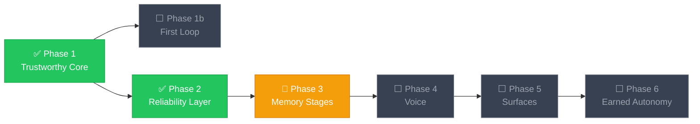

<div align="center">

# 🧠 AgentOS — *Friday*

**A resident desktop AI agent kernel for Windows.**

[](https://python.org)
[](LICENSE)
[](https://github.com/NastyRunner13/AgentOS)
[](https://openrouter.ai)

<br/>

One Python kernel process owns an asyncio event bus. A **master** agent clarifies ambiguous requests, wraps risky actions in **cards**, and delegates — while you keep working. Long work runs as background **tasks** you can **steer**.

Phases 1–2 are implemented. Phase 3 is memory stage 1 *(librarian proposals, confirmed-fact recall)*.
Voice, the Tauri desktop shell, and the phone PWA are specified — not yet built.

<br/>

</div>

---

## ⚡ Quick Start

> **Prerequisites:** Python 3.11+ · Windows · An [OpenRouter](https://openrouter.ai) API key

```bash
# Clone & install
git clone https://github.com/NastyRunner13/AgentOS.git
cd AgentOS
pip install -e ".[dev]"

# Configure
copy .env.example .env
# → Set OPENROUTER_API_KEY in .env
```

```bash
# Run
python main.py --cli          # Interactive agent session
python -m pytest -q            # Run test suite (offline, no keys needed)
python main.py --eval          # Evaluation harness
```

Inside the CLI: `/help` lists commands · `/new` and `/resume` manage conversations · `/reload` hot-reloads `config/*.yaml` · `/approve <id>` resolves a **card** or memory proposal. Ring-2 cards during a turn ask `y`/`n` inline.

---

## ✨ What Works Today

<table>
<tr>
<td width="50%" valign="top">

### 🔧 Kernel & Runtime
- Async event bus with concurrent **tasks**
- Mid-flight **steer** message routing
- Permission **rings** 0–3 with expiring **cards**
- Ring 2+ actions block until approved

</td>
<td width="50%" valign="top">

### 🤖 Model Registry
- **Providers:** OpenRouter · OpenAI · Anthropic · Ollama
- **Roles:** `master` · `fast` · `vision` · `embeddings`
- Swap any role in `config/models.yaml` — zero code changes

</td>
</tr>
<tr>
<td width="50%" valign="top">

### 🛠️ Native Tools
- **Shell** — PowerShell execution with permission gating
- **Files** — Sandboxed filesystem access
- **Browser** — Playwright-powered web automation
- **Computer** — UIA/a11y first, Set-of-Marks fallback, **verified** after every action, **stuck → ask**

</td>
<td width="50%" valign="top">

### 🧠 Memory & Eval
- SQLite L2 episodic log (audit trail)
- Stage-1 graph proposals (facts · entities · edges)
- Librarian drafts; graph writes only after `/approve`
- Eval harness: `success%` · `latency` · `token cost` · `human interventions` · `cost per accepted outcome`

</td>
</tr>
</table>

---

## 🏗️ Architecture

```
AgentOS/
│
├── config/            # models.yaml · permissions.yaml · kernel.yaml · memory.yaml
│
├── kernel/            # Event bus · task manager · steer routing · permission gate
├── brain/             # Model registry · master agent · librarian
├── memory/            # SQLite L2 + stage-1 graph / proposals
├── tools/             # shell · files · browser · computer operator
│
├── evals/             # Phase 2 scenario suite & harness
├── tests/             # Kernel · tools · master · phase 1–3 acceptance tests
│
├── main.py            # Entrypoint:  --cli  |  --eval
└── pyproject.toml     # Package config & dependencies
```

> [!NOTE]
> Directories in ARCHITECTURE.md §11 (`voice/`, `mcp/`, `server/`, `ui/`, `desktop/`, `dashboard/`, `skills/`, `workflows/`) are planned but **not yet in the tree**.

---

## 🔐 Permission Rings

| Ring | Scope | Gate |
|:---:|---|---|
| **0** | Reads: screen, files, web fetch | 🟢 Silent |
| **1** | App launch, writes in approved roots, browser actions | 🟡 Silent, logged |
| **2** | Shell outside allowlist, installs | 🟠 **Card** required — scoped grants allowed |
| **3** | Deletes above threshold, purchases, sends, credentials | 🔴 Explicit confirm — no scope grants |

---

## 🧬 Memory Stages

| Stage | What May Land in the Graph | Status |
|:---:|---|:---:|
| **0** | L2 events always. Facts/entities/edges only after human **approve**. No librarian. | ✅ Shipped |
| **1** | Librarian may insert *proposals*. Graph apply still only after **approve**. Bulk-approve allowed. | 🔨 Active |
| **2** | Auto-consolidate after each session. | 🔒 Locked |

---

## 📚 Documentation

| Document | When to open it |
|---|---|
| [`AGENTARCH.md`](AGENTARCH.md) | Changing behavior — phases, **DONE WHEN**, bus topics, **rings**, leading words |
| [`PRINCIPLES.md`](PRINCIPLES.md) | Adding a **loop**, **node**, skill, schedule, verifier, memory write path, or anything unattended |
| [`ARCHITECTURE.md`](ARCHITECTURE.md) | Changing design rationale — *not* the behavior spec |
| [`AGENTS.md`](AGENTS.md) | Working in this repo as a coding agent — commands, gotchas, reality vs plan |
| [`CONTRIBUTIONS.md`](CONTRIBUTIONS.md) | Landing a patch — spec-first, tests, commit shape, review bar |

---

## 🗺️ Roadmap



---

## 🧪 Running Tests

```bash
# All tests (offline, no API keys needed)
python -m pytest -q

# Single test
python -m pytest tests/test_phase1.py::test_c_ring2_shell_blocks_until_approved

# Eval harness
python main.py --eval
```

> [!TIP]
> Tests use `FakeAdapter` with scripted responses — no API keys required. Run pytest from the repo root; imports rely on `pythonpath = ["."]`.

---

## ⚙️ Configuration

All behavior is driven by YAML config — swap models, tune permissions, and adjust memory settings without touching code:

| File | Controls |
|---|---|
| `config/models.yaml` | Provider selection, role → model mapping |
| `config/permissions.yaml` | Ring assignments, allowlists, grant rules |
| `config/kernel.yaml` | Bus settings, task concurrency, timeouts |
| `config/memory.yaml` | Stage gate (`0`/`1`/`2`), recall limits, librarian params |

> OpenRouter is the default LLM provider. Set `OPENROUTER_API_KEY` in your `.env` file.
> Secrets never enter prompts, logs, or the episodic DB.

---

<div align="center">

**Built with 🧪 rigor and 🔒 trust by design.**

*Autonomy is earned, never assumed.*

</div>
