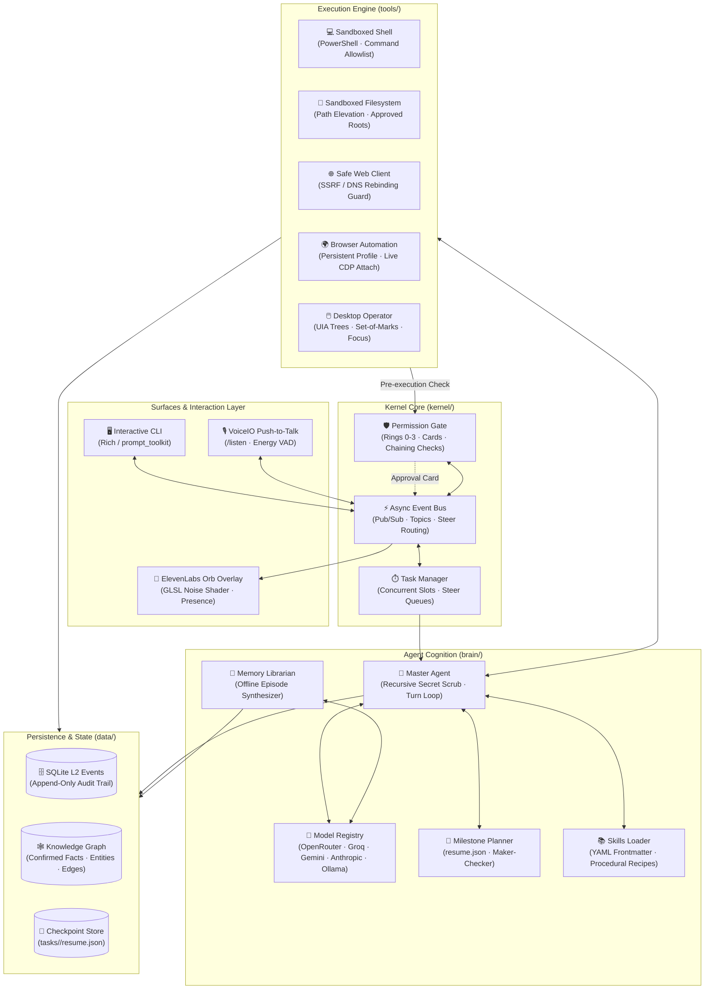
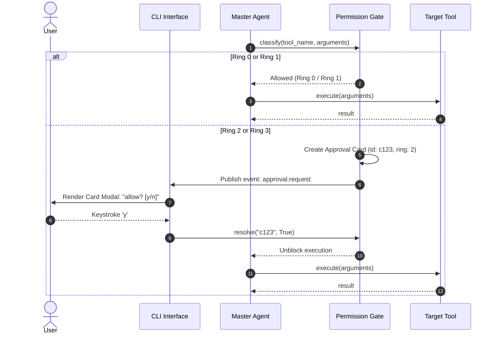
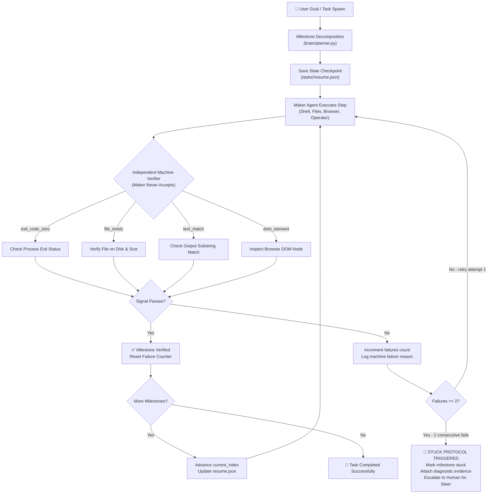
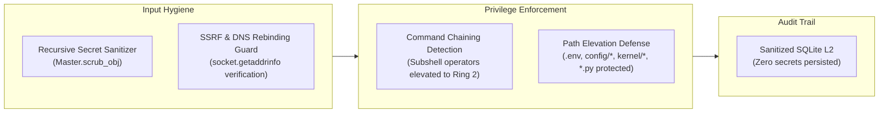
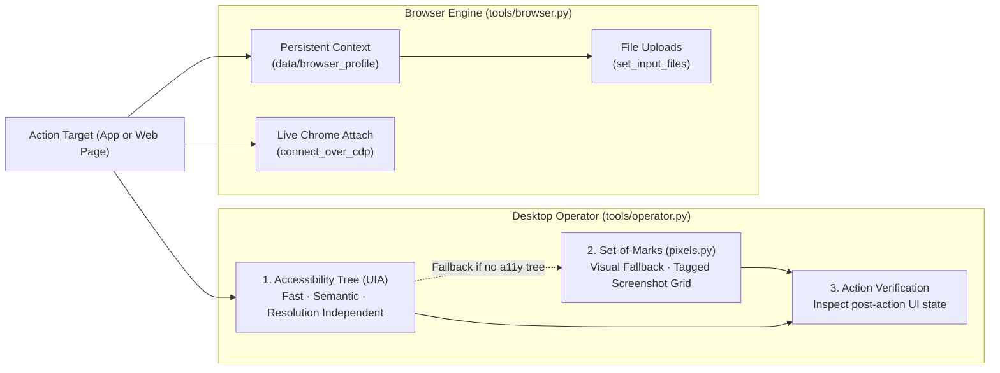

<div align="center">

# 🧠 AgentOS — *Friday*

**A resident desktop AI agent kernel for Windows with earned autonomy, permission rings, machine-verified milestone loops, and multi-modal interaction.**

[](https://python.org)
[](LICENSE)
[](https://github.com/NastyRunner13/AgentOS)
[](https://openrouter.ai)
[](config/permissions.yaml)
[](tests/)

<br/>

> **"Autonomy is earned, never assumed."**
> Friday is not a conversational wrapper or an unchecked autonomous script. It is an operating system kernel for AI agents: a single async process owning an event bus, strict security gates, interactive decision cards, procedural skills, and independent machine-verified milestone loops.

<br/>

</div>

---

## 📑 Table of Contents

- [System Architecture](#-system-architecture)
- [Quick Start](#-quick-start)
- [Deep Architectural Understandings](#-deep-architectural-understandings)
  - [1. Permission Rings & Gate Cards](#1-permission-rings--gate-cards)
  - [2. Interactive Clarification & Choice Cards](#2-interactive-clarification--choice-cards)
  - [3. Milestone Planner & Independent Machine Verification](#3-milestone-planner--independent-machine-verification)
  - [4. Defense-in-Depth Security Invariants](#4-defense-in-depth-security-invariants)
  - [5. Procedural Memory & Skills System](#5-procedural-memory--skills-system)
  - [6. Dual-Perception Desktop Operator & Browser Automation](#6-dual-perception-desktop-operator--browser-automation)
  - [7. Memory Evolution: Episodic L2 & Stage-1 Graph](#7-memory-evolution-episodic-l2--stage-1-graph)
  - [8. VoiceIO & The ElevenLabs Shader Orb](#8-voiceio--the-elevenlabs-shader-orb)
- [CLI Surface & Command Reference](#-cli-surface--command-reference)
- [Configuration Matrix](#-configuration-matrix)
- [Testing & Evaluation](#-testing--evaluation)
- [Roadmap & Phased Delivery](#-roadmap--phased-delivery)
- [Documentation Index](#-documentation-index)

---

## 🏗️ System Architecture

AgentOS decouples the agent runtime into distinct, asynchronously coordinated layers communicating over an in-process **asyncio Event Bus**.



---

## ⚡ Quick Start

> **Prerequisites:** Python 3.11+ · Windows 10/11 · An [OpenRouter](https://openrouter.ai) or Anthropic/OpenAI API key.

```bash
# 1. Clone & install development dependencies
git clone https://github.com/NastyRunner13/AgentOS.git
cd AgentOS
pip install -e ".[dev]"

# 2. Configure environment credentials
copy .env.example .env
# → Open .env and add your OPENROUTER_API_KEY
```

```bash
# 3. Launch interactive CLI
python main.py --cli

# 4. Launch with voice & ElevenLabs floating shader orb
python main.py --cli --voice

# 5. Run test suite (100% offline, uses deterministic FakeAdapter, no API keys needed)
python -m pytest -q

# 6. Run evaluation harness
python main.py --eval
```

---

## 🔍 Deep Architectural Understandings

### 1. Permission Rings & Gate Cards

Actions performed by the agent do not execute unchecked. Every tool invocation passes through the **Gate** (`kernel/gate.py`), where it is classified into one of four permission rings based on `config/permissions.yaml`.

| Ring | Scope & Examples | Gate Enforcement | UI Presentation |
|:---:|---|---|---|
| **0** | Read operations: screen view, file read, web fetch | 🟢 **Silent** | Logged to L2 |
| **1** | App launch, approved directory writes, safe browser clicks | 🟡 **Silent, logged** | Terminal banner update |
| **2** | Non-allowlisted shell commands, package installations, chained commands, edits to `.env`, `config/`, `kernel/`, `*.py` | 🟠 **Card Required** | Inline interactive card modal (`y`/`n`) or `/approve <id>` |
| **3** | Destructive deletions, financial actions, external communications, credential exfiltration | 🔴 **Explicit Confirm** | Mandatory explicit user approval, no scoped grants |



---

### 2. Interactive Clarification & Choice Cards

When a request cannot proceed without a fork (which person, which of two named apps) and there is no safe default, Friday triggers an **interactive Question Card**. Architecture, stack, and how to implement are not that fork. Friday chooses and continues.

1. **Pre-Turn Clarification:** The fast model checks user intent. If unclear, it emits 2–4 structured choices with an optional custom write-in.
2. **Mid-Turn Clarification (`ask_user` Tool):** During execution, the agent can call `ask_user` to pause execution, present trade-offs, and wait for human steering.
3. **Interactive Resolution:** The CLI renders a formatted card panel. Users press `1`, `2`, `3`, or enter write-in text `c`. Execution unblocks instantly.

```
╭─ card q104 · choice ────────────────────────────────────────────────────────╮
│ ┃  ◆ Clarification needed                                                   │
│ ┃  Which frontend state management architecture should we scaffold?        │
│ ┃                                                                           │
│ ┃  (1) Redux Toolkit (standard enterprise slice pattern)                    │
│ ┃  (2) Zustand (lightweight decoupled hooks)                                │
│ ┃  (3) Vanilla React Context + useReducer                                   │
│ ┃  (c) Custom write-in                                                      │
╰─────────────────────────────────────────────────────────────────────────────╯
  choice [1-3 or custom]: 2
  selected: Zustand (lightweight decoupled hooks)
```

---

### 3. Milestone Planner & Independent Machine Verification

Complex multi-step tasks run under the **Milestone Planner** (`brain/planner.py`), which implements the core tenets of [`PRINCIPLES.md`](PRINCIPLES.md):

- **Work is a Graph of Milestone Nodes:** Complex objectives are decomposed into sequential milestones.
- **Three Files a Loop Reads:** The task charter, the `resume.json` state checkpoint, and the SQLite L2 episodic log.
- **Maker Never Accepts:** The agent that writes code or takes action is **never** permitted to declare the step verified. An independent machine verifier evaluates real system signals.
- **Stuck Protocol:** If a milestone fails machine verification **two consecutive times**, Friday halts execution, attaches machine error evidence, and escalates to the user.



---

### 4. Defense-in-Depth Security Invariants

AgentOS is hardened against prompt injection, unauthorized privilege escalation, and network exfiltration:



- **SSRF & DNS Rebinding Protection (`tools/web.py`):** Before making HTTP requests or navigating Chromium, target hosts are resolved via `socket.getaddrinfo`. IP addresses in loopback (`127.0.0.0/8`), private ranges (`10.0.0.0/8`, `172.16.0.0/12`, `192.168.0.0/16`), and rebinding domain aliases (`*.nip.io`) are strictly blocked. HTTP 301/302 redirects are validated manually to prevent redirect-based SSRF. `file://` schemes are disallowed.
- **Command Chaining & Subshell Elevation (`kernel/gate.py`):** Attackers cannot bypass allowlisted commands (e.g., `git status`) by appending malicious payloads. Commands containing chaining operators (`;`, `&`, `|`, `\n`, `\r`) are automatically elevated to **Ring 2** cards.
- **Sensitive Path Protection (`kernel/gate.py`):** Write or move actions targeting credentials (`.env`), system configuration (`config/*`), core agent logic (`kernel/*`), git metadata (`.git/*`), or python source files (`*.py`) are intercepted and require card approvals.
- **Recursive Secret Sanitization (`brain/master.py`):** Credentials, API tokens, and environment values parsed on boot are scrubbed recursively (`Master.scrub_obj`) across all nested dictionary and list payloads before entering prompts, logs, or `data/events.db`.

---

### 5. Procedural Memory & Skills System

Rather than re-deriving multi-step technical procedures from scratch on every run, AgentOS loads procedural memory from **Skills** (`skills/` and `~/.agents/skills`).

Each skill contains a standard `SKILL.md` file with YAML frontmatter defining name, description, and strict tool permissions (`allowed-tools`):

```yaml
---
name: browser-automation
description: Procedural workflows for stateful browser sessions, CDP attachment, and file uploads.
allowed-tools:
  - browser
  - web_fetch
user-invocable: true
---
```

**Shipped Production Skills:**
- [`browser-automation`](skills/browser-automation/SKILL.md): Persistent authentication profiles, Chrome DevTools Protocol (`CDP`) attachment, file/media uploads, and DOM state verification.
- [`git-workflow`](skills/git-workflow/SKILL.md): Atomic commit sequencing, minimal unified diff generation, branch isolation, and automated test validation.
- [`terminal-debugging`](skills/terminal-debugging/SKILL.md): Diagnostic compiler output capture, isolate-and-reproduce patterns, and atomic regression checks.

Skills can be invoked manually via slash commands (`/browser-automation`) or automatically loaded by the Master agent.

---

### 6. Dual-Perception Desktop Operator & Browser Automation

Friday interacts with Windows applications and the web using a dual-perception model:



1. **Accessibility First (A11y/UIA):** Friday inspects the Windows UI Automation accessibility tree to locate buttons, text boxes, and menus by name and control type.
2. **Pixels & Set-of-Marks Fallback:** For custom-rendered interfaces or games without accessibility trees, Friday captures a screenshot (`computer see`), attaches it to the turn as an image, and clicks `x`,`y` in that image's pixels. Automatic Set-of-Marks grounding still runs only when the a11y tree is empty.
3. **Persistent Browser Sessions:** Playwright operates with a persistent user profile directory (`data/browser_profile`) to preserve cookies, sessions, and credentials across runs, with optional live CDP attachment to existing Chrome instances.

---

### 7. Memory Evolution: Episodic L2 & Stage-1 Graph

AgentOS maintains an append-only audit log and an earned knowledge graph:

| Stage | Memory Store | Description | Write Gate |
|:---:|---|---|---|
| **L2 Episodic** | SQLite (`data/events.db`) | Every user prompt, agent thought, tool call, tool result, and card approval. | Append-only, automated |
| **Stage 0** | Knowledge Graph (`data/graph.db`) | Confirmed user facts, entities, and relationships. | Human `/approve` required |
| **Stage 1** | Librarian Proposals | Offline librarian agent synthesizes recent episodes and creates memory proposals. | Human `/approve` or `/approve all` |
| **Stage 2** | Auto-Consolidation | Fully autonomous post-session memory consolidation. | 🔒 Locked until reliability metrics pass |

---

### 8. VoiceIO & The ElevenLabs Shader Orb

When launched with `--voice`, Friday activates a native voice loop alongside a floating visual presence:

- **Push-to-Talk & Energy VAD:** Speak using `/listen`, trigger via configurable hotkeys, or click the visual orb.
- **High-Performance Noise Shader Overlay (`orb/shader.py`):** A custom Tkinter/PIL window renders a multi-octave 3D Simplex noise shader running in a dedicated worker thread.
- **Real-Time State Mapping:**
  - 🔵 **Blue / Cyan:** Idle listening state
  - 🟣 **Purple / Violet:** Active model thinking and milestone verification
  - 🟢 **Green / Teal:** Talking / audio playback
  - 🟠 **Amber:** Permission or Question Card awaiting human interaction
  - ⚫ **Muted Grey:** Sleep / Muted state

---

## 💻 CLI Surface & Command Reference

The Friday CLI (`main.py --cli`) provides keyboard-driven shortcuts, real-time streaming, and interactive control:

### Slash Commands

| Command | Action |
|---|---|
| `/help` | Print comprehensive CLI command reference |
| `/new` or `/reset` | Clear session history and start a fresh turn |
| `/resume [id]` | Pick or switch to a previously saved conversation |
| `/sessions` | View saved interactive sessions |
| `/rename <title>` | Rename the active session |
| `/mode [Code\|Architect\|Ask\|Fast]` | Switch the active persona and system prompt |
| `/plan` | View and render current workspace `plan.md` |
| `/tasks` | List running and completed background tasks |
| `/task <title> <prompt>` | Launch an asynchronous background task |
| `/steer <id> <text>` | Inject guidance into a running background task |
| `/approve <id>` | Approve a pending Ring 2/3 card or memory proposal |
| `/deny <id>` | Deny and dismiss a pending approval card |
| `/approve all` | Bulk-approve all pending memory proposals |
| `/facts` | Inspect user-confirmed knowledge graph facts |
| `/proposals` | List unconfirmed memory proposals drafted by librarian |
| `/consolidate` | Run the librarian to propose new graph facts from recent turns |
| `/skills` | Browse catalog of available procedural skills |
| `/reload` | Hot-reload all YAML configurations and skills without restarting |
| `/listen` | Start push-to-talk microphone recording |
| `/orb` | Toggle visibility of the floating ElevenLabs shader orb |
| `/exit` or `/quit` | Save session and exit AgentOS |

### Keyboard Shortcuts

- <kbd>Ctrl</kbd> + <kbd>X</kbd> — Cycle operational modes (`Code` → `Architect` → `Ask` → `Fast`).
- <kbd>1</kbd> .. <kbd>9</kbd> — Instant selection during Question Cards.
- <kbd>y</kbd> / <kbd>n</kbd> — Instant inline approval/denial of Permission Cards.
- `@filename` — Expand and inline file content directly into your prompt.

---

## ⚙️ Configuration Matrix

All behavior is declarative. Modify files in `config/` to tune parameters without touching code:

| Configuration File | Controlled Parameters |
|---|---|
| [`config/models.yaml`](config/models.yaml) | Provider definitions (OpenRouter, Groq, Gemini, Anthropic, OpenAI, Ollama), API keys, and model mappings for `master`, `fast`, `vision`, and `embeddings` roles. |
| [`config/permissions.yaml`](config/permissions.yaml) | Tool classification into Rings 0–3, shell command allowlists, filesystem sandboxes, and web fetch restrictions. |
| [`config/kernel.yaml`](config/kernel.yaml) | Event bus concurrency slots, max tool steps per turn, pre-turn clarify toggles, and data directories. |
| [`config/memory.yaml`](config/memory.yaml) | Memory stage gate (`0`, `1`, `2`), recall limits, and librarian consolidation parameters. |
| [`config/voice.yaml`](config/voice.yaml) | STT engine (Groq Whisper, local Whisper), TTS engine (ElevenLabs, Edge-TTS), and audio device settings. |

---

## 🧪 Testing & Evaluation

The AgentOS repository enforces rigorous testing before any capability ships:

```bash
# Run all 173 unit, security, and integration tests (100% offline)
python -m pytest -q

# Run specific subsystem test suites
python -m pytest tests/test_phase1.py         # Kernel, Gate, and Bus contracts
python -m pytest tests/test_kernel.py         # Gate permissions, command chaining, path elevation
python -m pytest tests/test_tools.py          # Shell, files, SSRF protection, browser tools
python -m pytest tests/test_question_card.py  # Multiple-choice cards & clarification flows
python -m pytest tests/test_phase2.py         # Long-horizon reliability & operator tests
python -m pytest tests/test_phase3.py         # Memory L2, proposals, and librarian tests
python -m pytest tests/test_phase5.py         # Voice presence & ElevenLabs orb shader tests

# Run the Phase 2 Reliability & Cost Evaluation Harness
python main.py --eval
```

> [!NOTE]
> Tests run completely offline and require no API keys. The test suite leverages `FakeAdapter`, a scripted mock adapter verifying tool calls and gate invariants deterministically.

---

## 🗺️ Roadmap & Phased Delivery

```mermaid
graph LR
    P1["✅ Phase 1\nTrustworthy Core\n(Bus · Gate · L2 · Shell)"]
    P2["✅ Phase 2\nReliability Layer\n(Planner · Operator · Eval)"]
    P3["🔨 Phase 3\nMemory Stages\n(Librarian · Stage 1 Graph)"]
    P4["🔨 Phase 4\nVoice Subsystem\n(Push-to-Talk · VAD)"]
    P5["🔨 Phase 5\nSurfaces\n(Shader Orb · Rich CLI)"]
    P6["⬜ Phase 6\nEarned Autonomy\n(Self-Directed Loops)"]

    P1 --> P2
    P2 --> P3
    P3 --> P4
    P4 --> P5
    P5 --> P6

    style P1 fill:#22c55e,stroke:#16a34a,color:#fff
    style P2 fill:#22c55e,stroke:#16a34a,color:#fff
    style P3 fill:#f59e0b,stroke:#d97706,color:#fff
    style P4 fill:#f59e0b,stroke:#d97706,color:#fff
    style P5 fill:#f59e0b,stroke:#d97706,color:#fff
    style P6 fill:#374151,stroke:#6b7280,color:#9ca3af
```



---

## 📚 Documentation Index

Before modifying system behavior or writing new tools, consult the working contracts:

| Document | Purpose & Scope |
|---|---|
| [`AGENTARCH.md`](AGENTARCH.md) | **Working Behavioral Contract:** Acceptance criteria, bus topics, permission rings, leading-word definitions. Behavior changes are specified here first. |
| [`PRINCIPLES.md`](PRINCIPLES.md) | **Invariants for Autonomy:** Rules for autonomous loops, independent verifiers, checkpoint files, and stuck protocols. |
| [`ARCHITECTURE.md`](ARCHITECTURE.md) | **Design Rationale:** In-depth explanation of architectural decisions and long-term subsystem layout. |
| [`CONTRIBUTIONS.md`](CONTRIBUTIONS.md) | **Contribution Bar:** Patch lifecycle, spec-first reviews, and test coverage requirements. |
| [`AGENTS.md`](AGENTS.md) | **Agent Working Guide:** Instructions for AI coding assistants working within this repository. |

---

<div align="center">

**AgentOS is built with 🧪 rigor and 🔒 trust by design.**

*Autonomy is earned, never assumed.*

</div>
